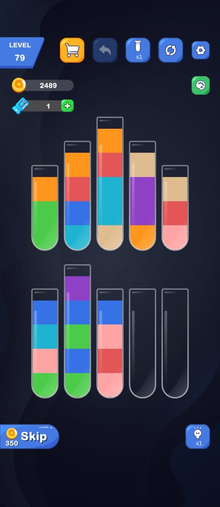

    <h1 align="center">Tube Color Detector

</h1>

A work in progress program that takes image of bottles containing liquid of different colors and gives output as arrays containing the colors in an ordered arrangement.

# Sample Input Images

    

